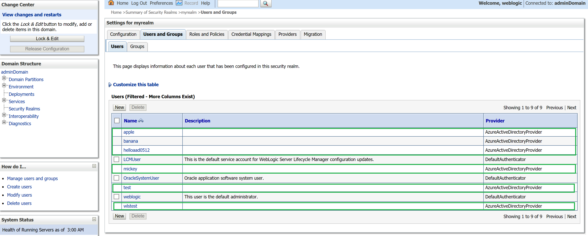

This article intoduces how to deploy a secure Java EE application to Weblogic server with basic authentication using Azure Active Directory (AAD) authentication provider.

## Prerequisites
* Install [Oracle JDK 8](https://www.oracle.com/technetwork/java/javase/downloads/jdk8-downloads-2133151.html)  
* Install [mvn](https://maven.apache.org/download.cgi)  
* [Azure Active Directory with LDAP configured](https://docs.microsoft.com/en-us/azure/active-directory-domain-services/tutorial-configure-ldaps).
* Set up [WebLogic Server that has integrated Azure Active Directory](https://portal.azure.com/#create/oracle.20191009-arm-oraclelinux-wls-admin-preview20191009-arm-oraclelinux-wls-admin)  

## Create secure roles
We will only allow users with `webuser` role to access the application.  
We will set up role named webuser to secure Java EE applciation, granting users from AAD group "wls-security" with the role.  
Firstly, create group name `wls-security` in AAD and add user to the group.  
* Go to azure portal https://ms.portal.azure.com and login.  
* Search `Active Directory`, and click "Azure Active Directory"  
* Go to "Manage" in the left panel, click "Users"  
* Click "New user", select "Create user"
* Specify "User name" with test
* Specify "Name" with Test， Click Create.  
* Go back to Azure Active Direcroty by clicking "Default Direcroty | Overview"  
* Go to "Manage" in the left panel, click "Groups" 
* Click "New Group" 
* Specify "Group Name" with `wls-security`
* Hit Create
It will take several seconds to create the group, when it ready, click group "wls-security", click members and add user "test" to the group.
We need to reset password of user test for the first login, otherwise, the initial password is not available.
Continue the steps:  
* Go to "Manage" in the left panel, click "Users"  
* Click user "Test"  
* Click "Reset Password" to reset password, and copy the temporary password and save in a file, we will use it to login azure later on  
* Copy the User Principal Name(e.g. test@helloaad0512outlook.onmicrosoft.com) and save in a file, we will use it to login azure later on    
* Open a new tab, or new browser and navigate to https://ms.portal.azure.com, if the browser logins automatically, logout first  
* Login azure with the account saved just now (e.g. test@helloaad0512outlook.onmicrosoft.com/password), azure will prompt a page to ask you to input new password, input your new password to reset password.  

Secondly, make sure Azure Active Directory is accessible from weblogic server, you will find users from AD provider in this page.  
  

Then create role in WebLoigc Server.
* Go to WebLogic Server console portal.  
* Click Security Realms -> myrealm -> Roles and Policies  
* Expand "Global Roles"  
* Click "Roles"  
* Click "New"  
* Specify "Name" with `webuser`  
* Click OK  
* Click "webuser" in role list  
* Click "Add Conditions"  
* Select "Predicate list" with "Group", click Next  
* Input AAD group "wls-security", and click "Add"  
* Click Finish, Click Save.  
Now, we have granted AAD users in AAD group "wls-security" with role "webuser".  
The next steps is to secure Java application with role "webuser".  

## Configure Java EE application security
We will limite access to the web application, only allow user with `webuser` role to login.  
We have to add security-constraint configuration to web.xml as following.  
```
<security-constraint>
        <web-resource-collection>
            <web-resource-name>Success</web-resource-name>
            <url-pattern>/welcome.jsp</url-pattern>
            <http-method>GET</http-method>
            <http-method>POST</http-method>
        </web-resource-collection>
        <auth-constraint>
            <role-name>webuser</role-name>
        </auth-constraint>
    </security-constraint>
    <login-config>
        <auth-method>BASIC</auth-method>
        <realm-name>myrealm</realm-name>
    </login-config>
    <security-role>
        <role-name>webuser</role-name>
    </security-role>
```
Besides, we need to configure weblogic as following:  
```
<?xml version='1.0' encoding='UTF-8'?>
<weblogic-web-app xmlns="http://www.bea.com/ns/weblogic/90" 
    xmlns:xsi="http://www.w3.org/2001/XMLSchema-instance">
    <security-role-assignment>
        <role-name>webuser</role-name>
        <principal-name>wls-security</principal-name>
    </security-role-assignment>
</weblogic-web-app>
```

`wls-security` is group from AAD, we created just now.  

## Deploy Java EE application
Build the application with command:  
```
mvn package
```
You will get wlssecurity-1.0.0.war in target folder.  

Then deploy the application to weblogic with the following steps:  
* Go to Admin Server console portal, click "Lock & Edit" to deploy app  
* Click "Deployments"  
* Clik Install  
* Click "Upload your file(s)"  
* Select "wlssecurity-1.0.0.war" and upload
* Click Next until Finish button is enable, and click "Finish"  
* Click Activate Changes  
* Click "Control"  
* Select "wlssecurity-1.0.0" and click Start, select "Servicing all requests"  

## Test with different users
Now, let open the application with url http://<adminhost>:7001/welsecurity-1.0.0, click "Login and go to welcome page"  
A login dialog prompts, it's required user account to login the application.  
Input "test" to "User Name", and input your new password set just now, the page will show  
```
Welcome test
Your role is webuser
```

If this page does not show up, you need to check your AAD user and password, you can login azure portal with the user to make sure you has the correct password.

If you input user from other group, you will fail to access welcome page.  